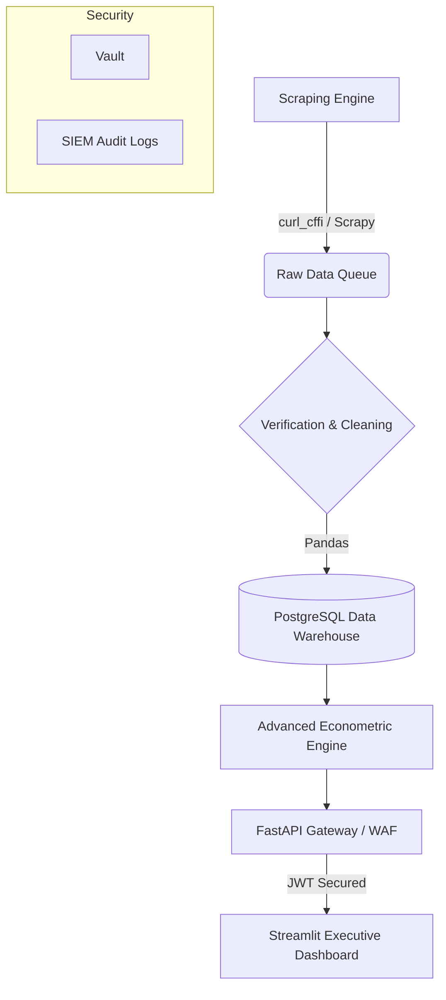

# System Architecture Document

## High-Level Data Flow

1. **Collect Fares (Ingestion Engine)**
   - Uses `Scrapy` and `curl_cffi` to mimic human browser activity via Browser Escalation.
   - Enforces Rate-Limit Control and Polite Backoff to respect host server thresholds.

2. **Secure & Verify (Security Layer)**
   - TLS/HTTPS encryption in transit.
   - Credentials pulled securely from a Vault (no hardcoded API keys).
   - Timestamping and Source-of-Truth verification.

3. **Clean & Standardize (Processing Layer)**
   - Pandas-driven deduplication and handling of missing values.
   - Fare Standardization (Base Fare + Taxes + Baggage = Total Observed Price).
   - Quoted vs Paid Price Realization analysis.

4. **Analyze & Detect (Mathematical Engine)**
   - Jevons Geometric Means and Laspeyres/Fisher indexing.
   - Anomaly Engine using Z-Scores and Isolation Forests to flag glitch prices.
   - COICOP 07.3.3 categorization.

5. **API Gateway (FastAPI)**
   - Serves data securely using JWT/OAuth2.
   - Guarded by a Web Application Firewall (WAF) and Rate Limiters.

6. **Government Dashboard (Streamlit)**
   - Authorized access only via Role-Based Access Control (RBAC).
   - Displays real-time sovereign indices, charts, and AI-driven insights.

## Component Interaction Diagram

